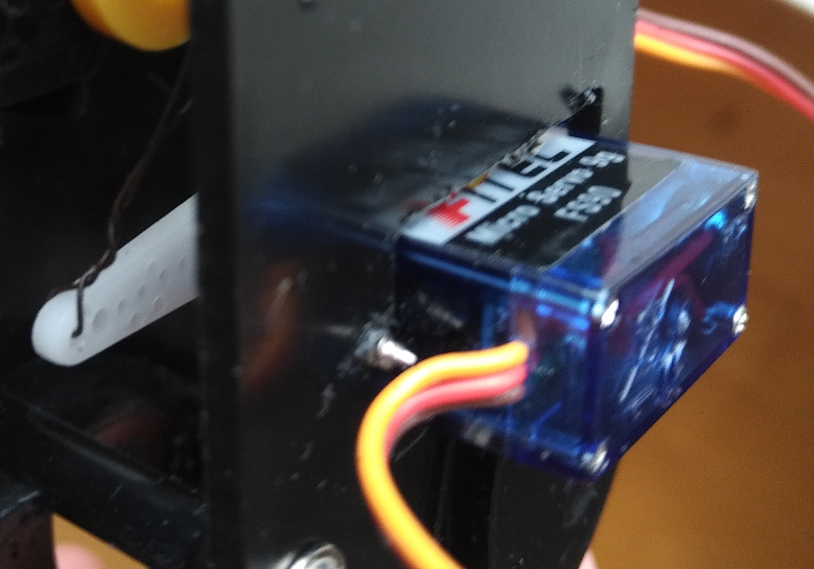
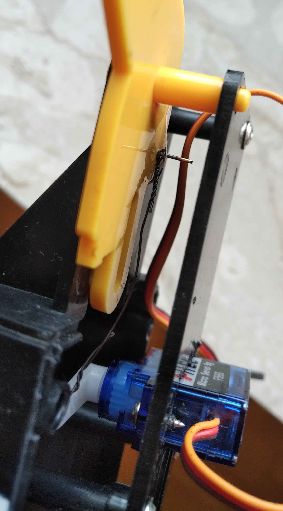
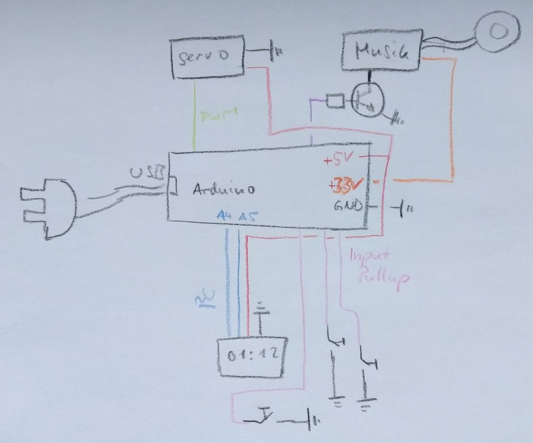
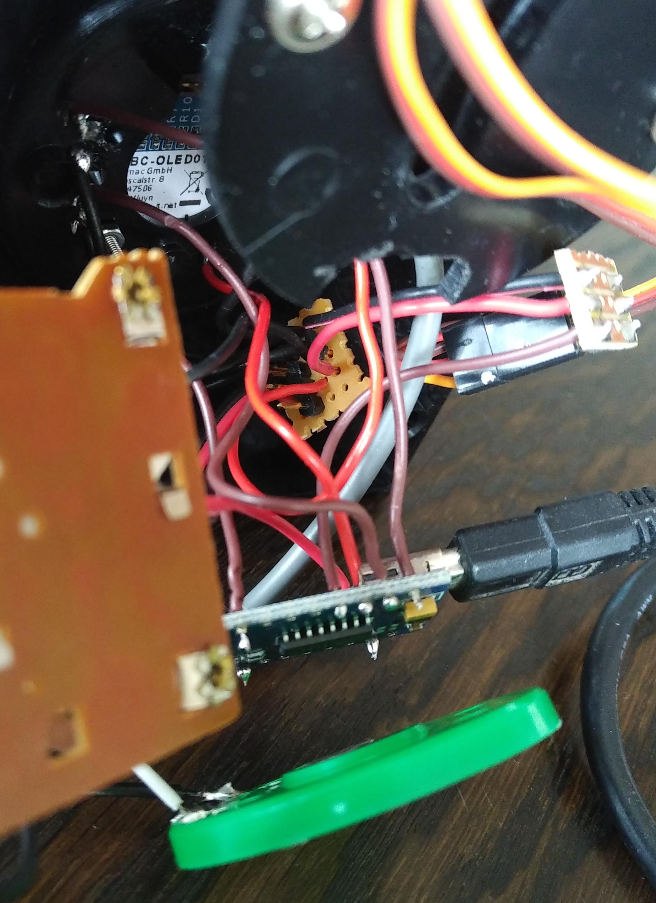
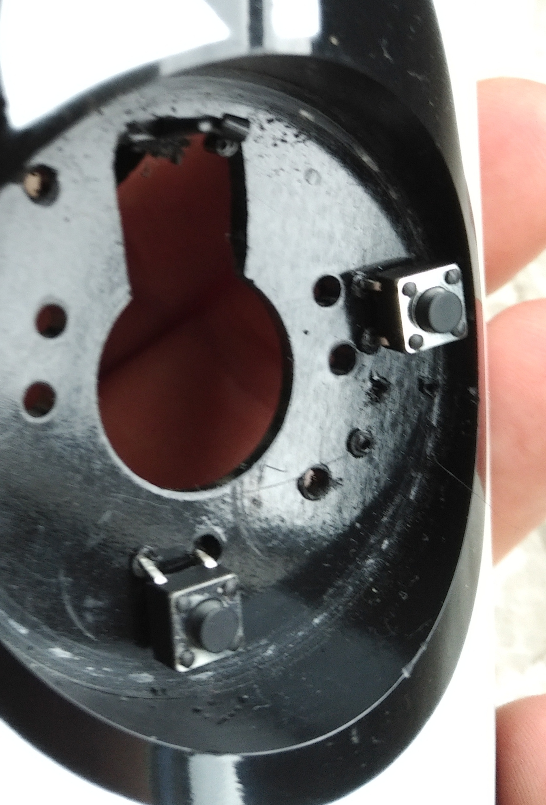
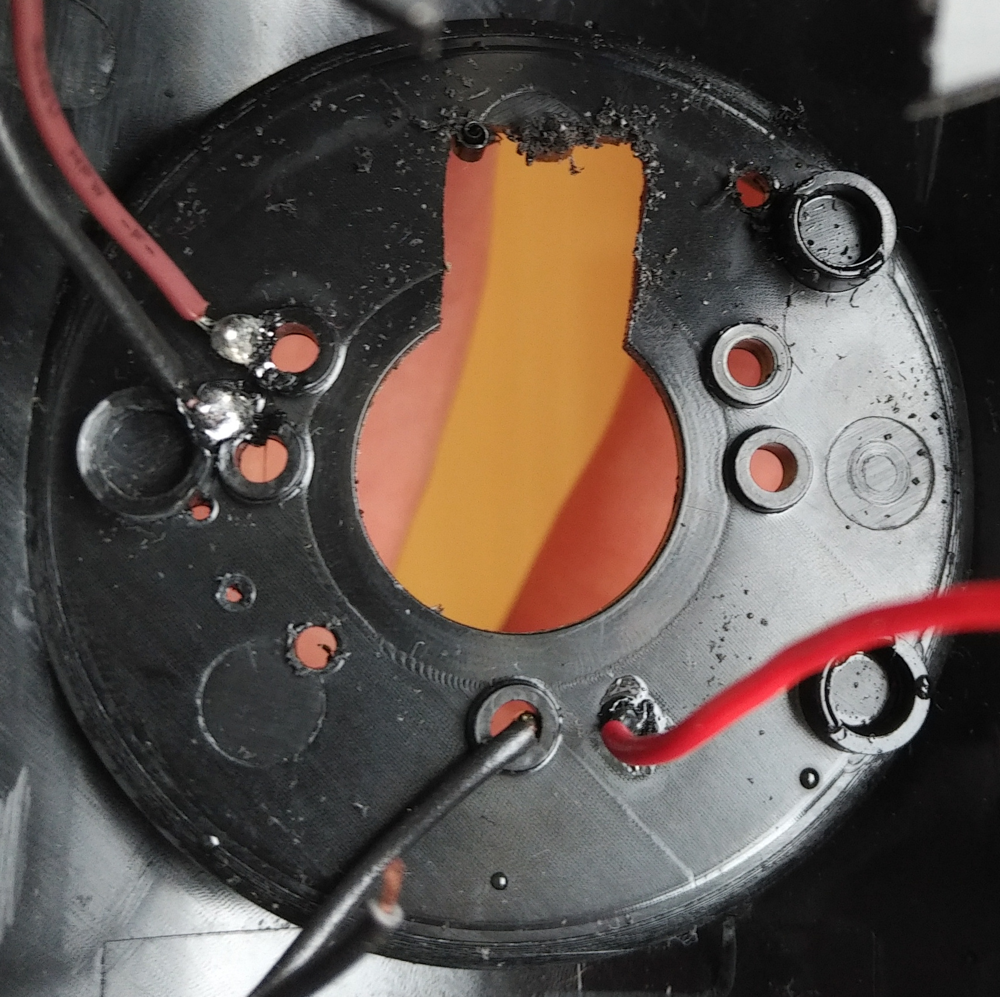

# Digitaler Tee-Pinguin TeePi

Basierend auf dem _Tea Boy_ wurde ein Assistent zum Tee-Kochen gebaut.

# Funktionsweise

1. Steckt man den TeePi ein, fährt der Schnabel hoch.
   Man kann jetzt den Teebeutel anhängen und eine Tasse mit heißem Wasser unterstellen.
1. Dann gibt man die Zeit ein, wie lange der Tee ziehen soll und drückt den Start-Knopf.
1. Der TeePi senkt den Schnabeln in den Tee und zeigt einen Timer an.
   Ist dieser abgelaufen, dann hebt der TeePi den Schnabel und spielt ein Lied, bis einer seiner Knöpfe drückt.
   Er ist dann bereit, den nächsten Tee aufzubrühen.

# Programmierung

Siehe das Programm
[`project01_digitaler-teepi.ino`](project01_digitaler-teepi.ino).

Dabei ist insbesondere spannend:

- Jede Teilfunktion des TeePi ist in einer Klasse gekapselt,  bspw. `Beak` für den Servo der den Schnabel bedient.
  Die Klassen sind unabhängig voneinander testbar, siehe dazu die `test_*`-Funktionen.
  Achtung: Damit diese funktionieren, muss in der `init()`-Funktion der entsprechende Teil einkommentiert sein.
- Damit der Arduino mehrere Sachen gleichzeitig machen kann, sind die einzelnen Teilfunktionalitäten so programmiert, dass sie nur etwas machen, wenn die `tick()`-Funktion aufgerufen wird.
  Will man bspw. den Schnabel absenken, dann ruft man `beak.down()` auf, es passiert aber nicht direkt etwas.
  Stattdessen nimmt diese Funktion nur gewisse "Vorbereitungen" in `beak`-Objekt vor.
  Erst wenn dann `beak.tick()` aufgerufen wird, bewegt sich der Schnabel.
  Die Funktion `DigitalTeePi::tick()` ruft dann auch nacheinander alle `tick()`-Funktionen der beteiligten Teilfunktionalitäten auf.
  (Hinweis:
  Für das Display gibt es keine `tick()`-Funktion, weil die Operation, etwas auf dem Bildschirm zu schreiben, sehr schnell abläuft.
  Schnell bedeutet dabei "schnell im Vergleich zu den anderen Teilfunktionalitäten" wie bspw. Schnabel-Heben.)
  - Um mit Zeiten zu arbeiten (bspw. um zu wissen, wie lange der Timer schon lief) wird die Funktion `millis()` verwendet und es wird gespeichert, wann etwas angefangen hat und mit dem aktuellen `millis()` verglichen.
  - Die einzelnen Klassen sind oft im Stil einer [State-Machine](https://de.wikipedia.org/wiki/Endlicher_Automat) implementiert.
  - Bei den Buttons wurde eine "Flankenerkennung" implementiert:
    Erst, wenn der Button von gedrückt auf nicht-gedrückt wechselt, wird das Drücken registriert.

# Aufbau

## Gerüst/Motor

Aus dem _Tea Boy_ wurde der Motor und der Mechanismus zum Heben und Senken des Schnabels entfernt.

In die Platte, die den Mechanismus gehalten hatte, wurde ein Loch gesägt (Laubsäge), in das gerade ein Servomotor passt.

Der Servomotor ist mit einem Draht mit dem Schnabel verbunden.
Um ihn dort zu befestigen, wurde ein Stück Nagel erhitzt und heiß in das Plastik des Schnabels gedrückt.
Das wieder erstarrte Plasti hält den Nagel fest und daran kann der Draht befestigt werden.

Der Servo bewegt sich "gegenläufig" zum Schnabel:
Dreht sich der Schnabel im Uhrzeigersinn, dann dreht sich der Servo dagegen.
Hintergrund: Der Motor lässt sich nicht beliebig plazieren; hätten sich Servo und Schnabel in die gleiche Richtung drehen sollen, dann hätte man die Motor-Achse unterhalb der Schnabel-Achse plazieren müssen, was nicht geht.

## Verkabelung

Microcontroller und Stromversorgung ist ein Arduino Nano.

Der Arduino hatte keine Stiftleisten eingelötet, sodass man selbst dort direkt Kabel anschließen und einlöten kann.

Eine kleine Streifenrasterplatine stellt mehrere GND und 5V-Anschlüsse bereit, die dann "gebündelt" an den Arduino verbunden werden.

Das Display und der Servo-Motor wurden mit Steckern angeschlossen, um diese notfalls leichter auswechseln zu können.

Zur Stromversorgung wird ein Ladegerät mit USB-Anschluss verwendet:
Es wird mit dem USB-Kabel verbunden, das aus dem TeePi herausragt und im Arduino endet.
Vorteil davon: Der TeePi ist immer noch programmierbar.

## Bedienelemente

Als Display dient ein i2c 0,96" OLED Display mit 128x64 Pixeln.
Es ist in Arduino leicht ansteuerbar, leicht zu verkabeln, günstig, braucht wenig Strom, und kann Text in verschiedenen Schriftgrößen darstellen.
Als Knöpfe dienen einfache Bush-Buttons.

Um Display und Knöpfe zu befestigen, wurden Löcher mit heißen Nadeln/Nägeln geschmolzen.
Die Anschlüsse für die Knöpfe wurden durchgesteckt und dann auf der Rückseite direkt mit den Kabeln verlötet, was schon ausreichend Stabilität bringt.
(Hinweis zum Löten: Ein Tropfen Lötzinn auf dem Lötkolben konnte direkt auf Knopfanschluss/Kabel gedrückt werden, was dann direkt noch das Plastik anschmilzt und weiter stabilisiert.)

Die Buttons verbinden, wenn sie gedrückt werden, jeweils einen digitalen Pin des Arduino, der im Modus `INPUT_PULLUP` arbeitet, mit GND.
Der Pin ist also `LOW` genau dann, wenn der Schalter gedrückt ist.

Um das Display einzubauen, wurde dort, wo früher die Zeit-Wählscheibe war, ein entsprechendes Loch gesägt, um die Anschlüsse zu erreichen.
An zwei Ecken wurden größere Löcher geschmolzen, durch die mit Metallschrauben/-muttern geschraubt wurden und das Display halten.

## Musik

Als Musikelement dient der Baustein, den man in Grußkarten finden kann.
Der Mechanismus, der die Karte normalerweise aktiviert, wurde "kurzgeschlossen" und die Spannungsversorgung über einen Transistor (BC547 mit 1k-Ohm-Widerstand an Basis) an den 3.3 V-Anschluss des Arduinos angeschlossen.
Durch den Transistor kann das komplette Modul ein/ausgeschaltet werden.
